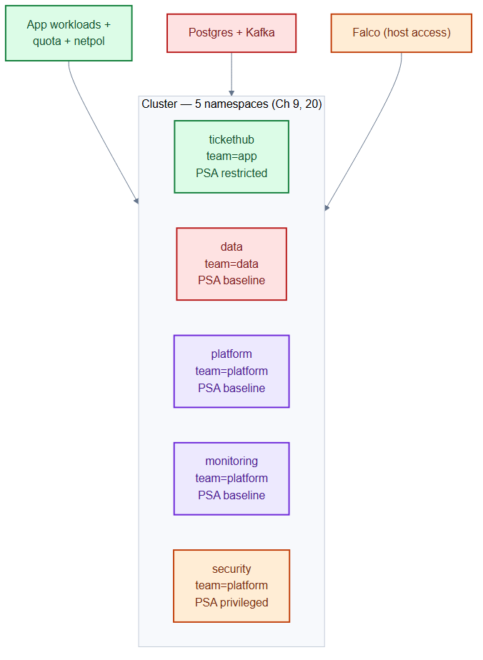
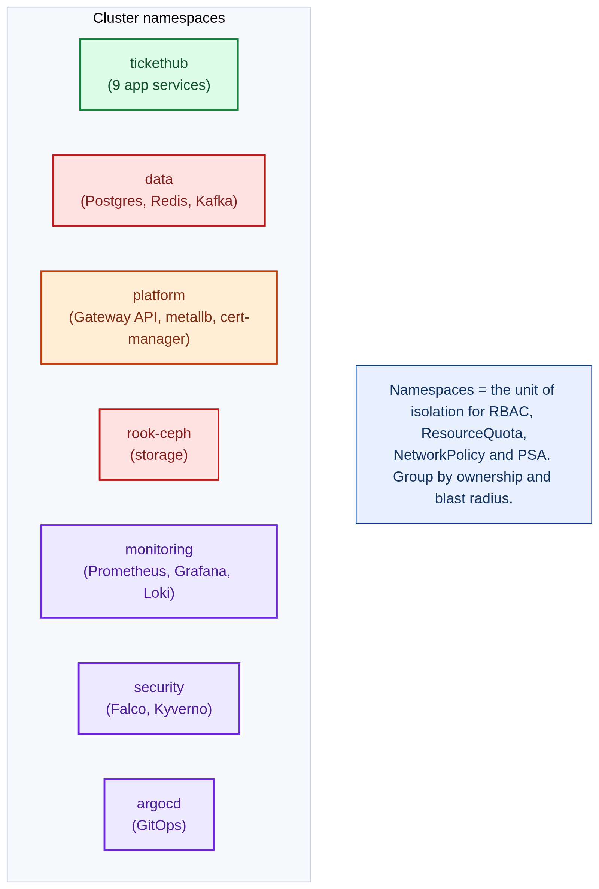

# namespaces.yaml — cluster tenancy boundaries

> **Folder:** `00-namespaces` · **Chapter:** [Ch 9 — Namespaces & Resources](../../../docs/09-namespaces-resources.md)

Defines the five namespaces that carve the cluster into isolated tenancy and
trust zones. Every other manifest in this repo lands in one of these. Each
namespace is stamped with a `team` label (ownership) and Pod Security Admission
(PSA) labels (the security floor for pods scheduled there).

## Objects in this file

| Kind | Name | Team | Pod Security (enforce) |
|---|---|---|---|
| Namespace | `tickethub` | app | **restricted** — the app tier |
| Namespace | `data` | data | baseline — Postgres, Kafka |
| Namespace | `platform` | platform | baseline — ingress, storage, cert-manager |
| Namespace | `monitoring` | platform | baseline — Prometheus, Tempo, OTel |
| Namespace | `security` | platform | **privileged** — Falco needs host access |

## How it works

- PSA labels (`pod-security.kubernetes.io/enforce`) make the API server reject
  pods that exceed the namespace's security level — no extra controller needed.
- `tickethub` is `restricted` (no root, no host mounts) because it runs
  untrusted-ish application code; `security` is `privileged` because Falco reads
  the host kernel.
- The `team` labels drive ownership, NetworkPolicy namespace selectors, and
  quota attribution.

## Relationships

**Interacts with**
- [`quota-limits.yaml`](quota-limits.yaml) — attaches quota/limits to `tickethub`.
- [`../60-security/network-policies.yaml`](../60-security/network-policies.yaml) — selects the `data` namespace by label for egress.
- Every workload/config manifest — they set `metadata.namespace` to one of these.

## Concept

See [Ch 9 — Namespaces & Resources](../../../docs/09-namespaces-resources.md) and
[Ch 20 — Pod Security](../../../docs/20-pod-security.md) for the full walkthrough.
