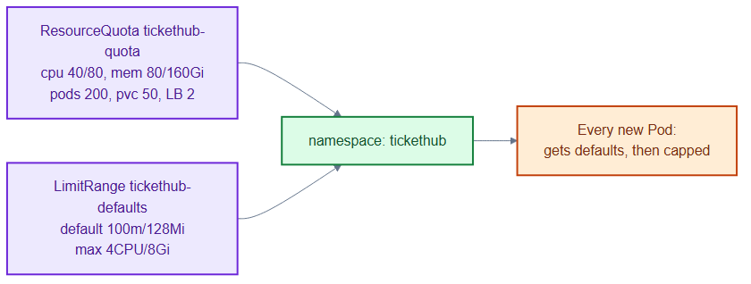
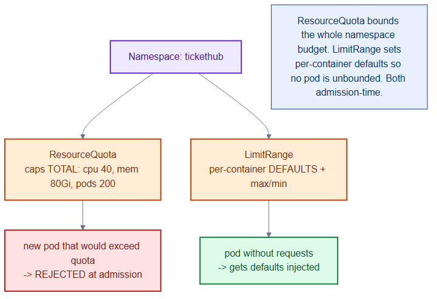

# quota-limits.yaml — capacity guardrails for the app namespace

> **Folder:** `00-namespaces` · **Chapter:** [Ch 15 — Resource Management](../../../docs/15-resource-management.md)

Caps the total resources the `tickethub` namespace can consume and supplies
per-container defaults so pods that omit requests/limits still behave.

## Objects in this file

| Kind | Name | Namespace | Key settings |
|---|---|---|---|
| ResourceQuota | `tickethub-quota` | `tickethub` | cpu 40/80, mem 80Gi/160Gi, pods 200, pvc 50, LB 2 |
| LimitRange | `tickethub-defaults` | `tickethub` | default req 100m/128Mi, default limit 500m/512Mi, max 4CPU/8Gi |

## How it works

- **ResourceQuota** is a hard ceiling for the whole namespace: once the sum of
  pod requests hits the quota, new pods are rejected at admission.
- **LimitRange** fills in defaults for any container that doesn't specify
  requests/limits, and rejects containers that ask for more than the max.
- Because the quota counts *requests*, every pod must set them — the LimitRange
  guarantees that, so the two objects work as a pair.

## Relationships

**Interacts with**
- [`namespaces.yaml`](namespaces.yaml) — the `tickethub` namespace these attach to.
- Every Deployment/Job in [`../30-workloads/`](../30-workloads/) — their requests are counted against the quota.
- [`../50-scaling/`](../50-scaling/) HPAs — scaling is bounded by remaining quota headroom.

## Concept

See [Ch 15 — Resource Management](../../../docs/15-resource-management.md) for the full walkthrough.
