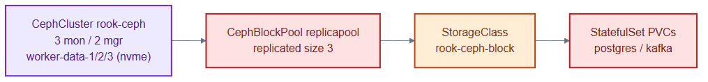
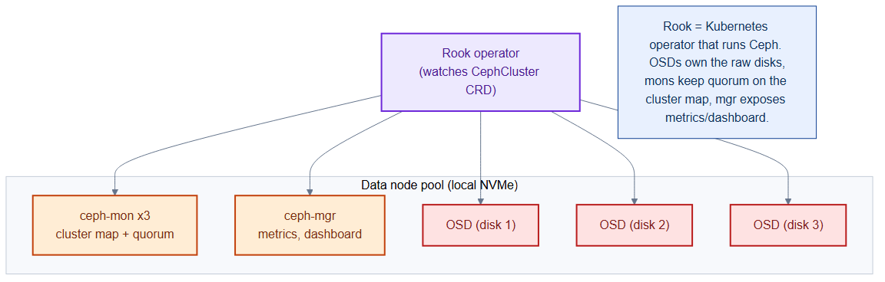

# ceph-cluster.yaml — Rook-managed Ceph storage backend

> **Folder:** `10-platform` · **Chapter:** [Ch 8 — Storage with Rook-Ceph](../../../docs/08-storage-rook-ceph.md)

Declares the Ceph storage cluster (managed by the Rook operator) and a
replicated block pool. This is the physical storage that ultimately backs every
PersistentVolume in the cluster.

## Objects in this file

| Kind | Name | Namespace | Key settings |
|---|---|---|---|
| CephCluster | `rook-ceph` | `rook-ceph` | Ceph v18.2, 3 mon / 2 mgr, on `worker-data-1/2/3` (nvme), tolerates `data` taint |
| CephBlockPool | `replicapool` | `rook-ceph` | replicated size 3, failure domain `host` |

## How it works

- The Rook operator reconciles the `CephCluster` CRD into real Ceph daemons
  (monitors, managers, OSDs) on the dedicated data nodes.
- `replicapool` keeps 3 copies of every block across different hosts, so a node
  loss doesn't lose data.
- Node affinity (`pool=data`) and taint tolerations pin Ceph to the storage
  nodes, keeping it off the app workers.

## Relationships

**Interacts with**
- [`storageclasses.yaml`](storageclasses.yaml) — `rook-ceph-block` points its provisioner at `replicapool`.
- [`../20-data/postgres-statefulset.yaml`](../20-data/postgres-statefulset.yaml) and [`kafka-statefulset.yaml`](../20-data/kafka-statefulset.yaml) — their PVCs are ultimately served by this pool.

## Concept

See [Ch 8 — Storage with Rook-Ceph](../../../docs/08-storage-rook-ceph.md) for the full walkthrough.
