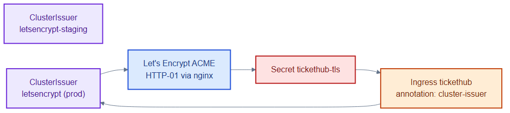
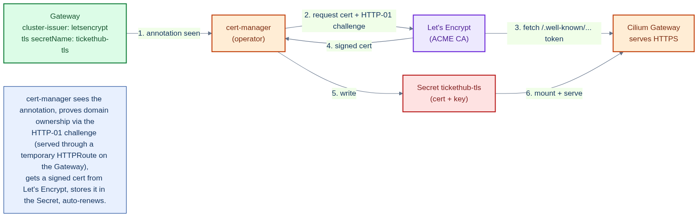

# cert-manager-issuers.yaml — public TLS via Let's Encrypt

> **Folder:** `10-platform` · **Chapter:** [Ch 7b — Certificates](../../../docs/07b-certificates.md)

Two cert-manager `ClusterIssuer`s that obtain **public**, browser-trusted TLS
certificates from Let's Encrypt using the ACME HTTP-01 challenge. These secure
the internet-facing Ingress. (Internal service-to-service certs use a separate
private CA — see [`../15-pki/`](../15-pki/).)

## Objects in this file

| Kind | Name | Scope | Key settings |
|---|---|---|---|
| ClusterIssuer | `letsencrypt-staging` | cluster | ACME staging (untrusted, for testing rate limits) |
| ClusterIssuer | `letsencrypt` | cluster | ACME production, HTTP-01 solver via nginx |

## How it works

- cert-manager watches `Certificate`/Ingress requests, answers the ACME HTTP-01
  challenge through the nginx ingress, and writes the signed cert into a Secret.
- Use `letsencrypt-staging` first to avoid hitting production rate limits, then
  switch to `letsencrypt`.

## Relationships

**Interacts with**
- [`ingress-tickethub.yaml`](ingress-tickethub.yaml) — its `cluster-issuer` annotation triggers issuance into the `tickethub-tls` Secret.
- [`../70-observability/cert-expiry-rule.yaml`](../70-observability/cert-expiry-rule.yaml) — alerts if certs approach expiry.

## Concept

See [Ch 7b — Certificates](../../../docs/07b-certificates.md) for the full walkthrough.
