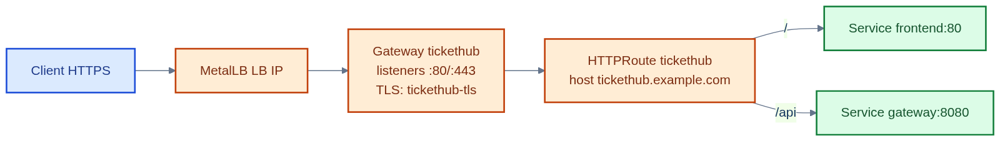
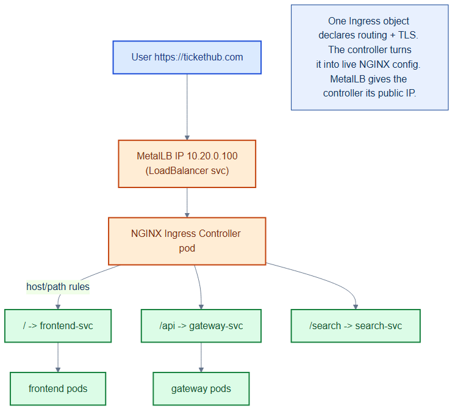

# gateway-tickethub.yaml — north-south HTTP entry point (Gateway API)

> **Folder:** `10-platform` · **Chapter:** [Ch 7 — MetalLB & Gateway API](../../../docs/07-metallb-ingress.md)

The **Gateway** + **HTTPRoute** pair that terminates TLS and routes external
traffic to the two public-facing services. This is the front door for all
browser and API traffic, and it replaces the legacy NGINX **Ingress** object.

## Objects in this file

| Kind | Name | Namespace | Role |
|---|---|---|---|
| Gateway | `tickethub` | `tickethub` | Owns the listeners (`:80` HTTP, `:443` HTTPS), TLS cert `tickethub-tls`, and `gatewayClassName: cilium` |
| HTTPRoute | `tickethub` | `tickethub` | App routing: `/api` → `gateway:8080`, `/` → `frontend:80` |
| HTTPRoute | `tickethub-https-redirect` | `tickethub` | 301-redirects all plain HTTP to HTTPS |

## How it works

- `gatewayClassName: cilium` tells Cilium's Gateway API controller to realise
  the Gateway as a `type=LoadBalancer` Service; **MetalLB** assigns its external IP.
- The `cert-manager.io/cluster-issuer` annotation on the **Gateway** makes
  cert-manager provision the `tickethub-tls` Secret automatically (ACME HTTP-01,
  solved through a temporary HTTPRoute on the `:80` listener).
- The `https` listener terminates TLS; the `HTTPRoute` forwards to backends by path.

## Why Gateway API instead of Ingress

- **Role separation**: the platform team owns the `Gateway` (listeners, TLS,
  IP); the app team owns the `HTTPRoute` (paths, backends). Ingress mixed both
  into one object.
- **Portable routing**: header/method/traffic-split routing is expressed in the
  **spec**, not vendor-specific `nginx.ingress.kubernetes.io/*` annotations.
- **Typed and validated**: routes are their own CRD, so `kubectl` and admission
  webhooks catch mistakes the Ingress annotation strings could not.

See [Ch 7 — MetalLB & Gateway API](../../../docs/07-metallb-ingress.md) for the full walkthrough.

## Relationships

**Interacts with**
- [`cert-manager-issuers.yaml`](cert-manager-issuers.yaml) — supplies the TLS cert via the `gatewayHTTPRoute` HTTP-01 solver.
- [`metallb-pool.yaml`](metallb-pool.yaml) — supplies the external LoadBalancer IP for the Gateway's Service.
- Services `frontend` and `gateway` — the routed backends (gateway is [`repo/services/gateway`](../../services/gateway)).

## Concept

