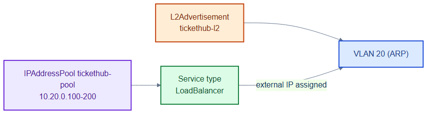
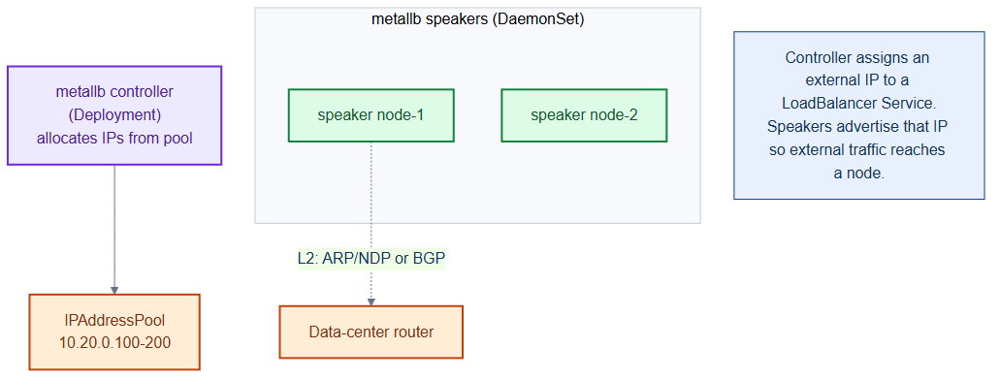

# metallb-pool.yaml — bare-metal LoadBalancer IPs

> **Folder:** `10-platform` · **Chapter:** [Ch 7 — MetalLB & Gateway API](../../../docs/07-metallb-ingress.md)

On bare metal there is no cloud load balancer, so MetalLB hands out external IPs
to `type: LoadBalancer` Services from a reserved pool and advertises them on the
LAN.

## Objects in this file

| Kind | Name | Namespace | Key settings |
|---|---|---|---|
| IPAddressPool | `tickethub-pool` | `metallb-system` | `10.20.0.100–10.20.0.200` (VLAN 20), autoAssign |
| L2Advertisement | `tickethub-l2` | `metallb-system` | advertises the pool via L2/ARP |

## How it works

- When a Service requests `type: LoadBalancer`, MetalLB allocates the next free
  IP from `tickethub-pool`.
- The `L2Advertisement` makes one node answer ARP for that IP, so the LAN routes
  traffic to it — no BGP required.

## Relationships

**Interacts with**
- [`gateway-tickethub.yaml`](gateway-tickethub.yaml) — the Gateway's LoadBalancer Service draws its external IP from this pool.
- [`quota-limits.yaml`](../00-namespaces/quota-limits.yaml) — caps `tickethub` to 2 LoadBalancers.

## Concept

See [Ch 7 — MetalLB & Gateway API](../../../docs/07-metallb-ingress.md) for the full walkthrough.
