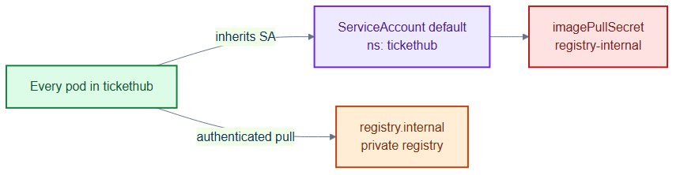
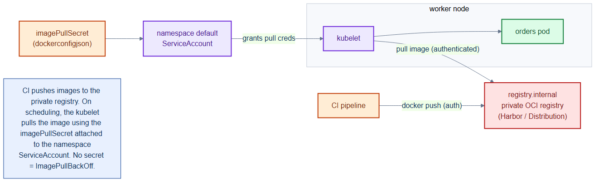

# registry-pull-secret.yaml — private registry authentication

> **Folder:** `10-platform` · **Chapter:** [Ch 10 — Containerizing](../../../docs/10-containerizing.md)

Wires the private image registry credential onto the `tickethub` namespace's
`default` ServiceAccount, so every pod can pull images from `registry.internal`
without per-pod configuration.

## Objects in this file

| Kind | Name | Namespace | Key settings |
|---|---|---|---|
| ServiceAccount | `default` | `tickethub` | `imagePullSecrets: [registry-internal]` |

## How it works

- Pods that don't name a ServiceAccount use `default`. By attaching the pull
  secret there, every pod inherits registry credentials automatically.
- The referenced Secret `registry-internal` (a `kubernetes.io/dockerconfigjson`
  secret, provisioned out of band) holds the registry login.

## Relationships

**Interacts with**
- All workloads in [`../30-workloads/`](../30-workloads/) — they pull `registry.internal/tickethub/*` images via this SA.
- [`../60-security/kyverno-policies.yaml`](../60-security/kyverno-policies.yaml) — `verify-image-signatures` checks those same images.

## Concept

See [Ch 10 — Containerizing](../../../docs/10-containerizing.md) for the full walkthrough.
