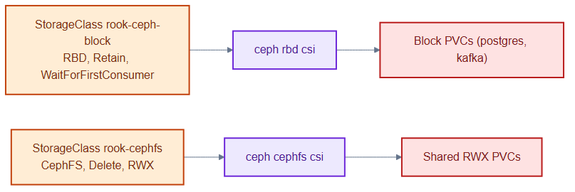
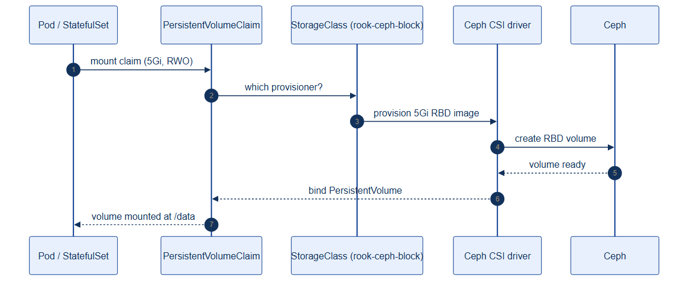

# storageclasses.yaml — how PVCs get provisioned

> **Folder:** `10-platform` · **Chapter:** [Ch 8 — Storage with Rook-Ceph](../../../docs/08-storage-rook-ceph.md)

Defines the two StorageClasses that PersistentVolumeClaims request by name. They
turn abstract "I need 20Gi" requests into real Ceph volumes.

## Objects in this file

| Kind | Name | Provisioner | Reclaim | Notes |
|---|---|---|---|---|
| StorageClass | `rook-ceph-block` | `rook-ceph.rbd.csi.ceph.com` | **Retain** | RWO block, `WaitForFirstConsumer`, expandable |
| StorageClass | `rook-cephfs` | `rook-ceph.cephfs.csi.ceph.com` | Delete | RWX shared filesystem, expandable |

## How it works

- **rook-ceph-block** is the default for databases: block volumes with
  `Retain` (a deleted PVC keeps the underlying volume, guarding against data
  loss) and `WaitForFirstConsumer` (bind only once a pod is scheduled, so the
  volume lands near the pod).
- **rook-cephfs** provides ReadWriteMany volumes for workloads that need shared
  file access across pods.

## Relationships

**Interacts with**
- [`ceph-cluster.yaml`](ceph-cluster.yaml) — `rook-ceph-block` is backed by the `replicapool`.
- [`../20-data/postgres-statefulset.yaml`](../20-data/postgres-statefulset.yaml) and [`kafka-statefulset.yaml`](../20-data/kafka-statefulset.yaml) — their `volumeClaimTemplates` name `rook-ceph-block`.

## Concept

See [Ch 8 — Storage with Rook-Ceph](../../../docs/08-storage-rook-ceph.md) for the full walkthrough.
