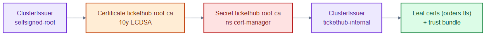
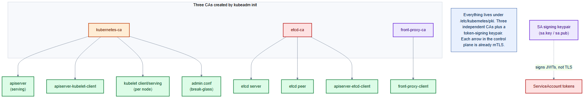

# internal-ca.yaml — private CA for internal mTLS

> **Folder:** `15-pki` · **Chapter:** [Ch 7b — Certificates](../../../docs/07b-certificates.md)

Bootstraps a **private** certificate authority used to issue certs for
service-to-service (east-west) TLS inside the cluster. Unlike the public
Let's Encrypt issuers in [`../10-platform/`](../10-platform/cert-manager-issuers.md),
these certs are only trusted within TicketHub.

## Objects in this file

| Kind | Name | Scope | Role |
|---|---|---|---|
| ClusterIssuer | `selfsigned-root` | cluster | bootstrap self-signed issuer |
| Certificate | `tickethub-root-ca` | `cert-manager` | the CA cert (10y, ECDSA-256) |
| ClusterIssuer | `tickethub-internal` | cluster | CA issuer backed by the root CA secret |

## How it works

- `selfsigned-root` signs the long-lived `tickethub-root-ca` certificate.
- That cert lands in the Secret `tickethub-root-ca`, which the
  `tickethub-internal` ClusterIssuer then uses to sign short-lived leaf certs
  for individual services.
- This is the classic two-tier PKI: one long-lived root, many short-lived leaves.

## Relationships

**Interacts with**
- [`orders-internal-cert.yaml`](orders-internal-cert.yaml) — its leaf cert is signed by `tickethub-internal`.
- [`trust-bundle.yaml`](trust-bundle.yaml) — distributes this root CA to every namespace so pods trust the leaves.

## Concept

See [Ch 7b — Certificates](../../../docs/07b-certificates.md) for the full walkthrough.
