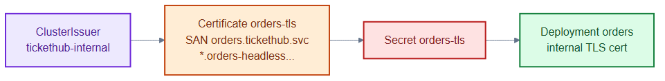
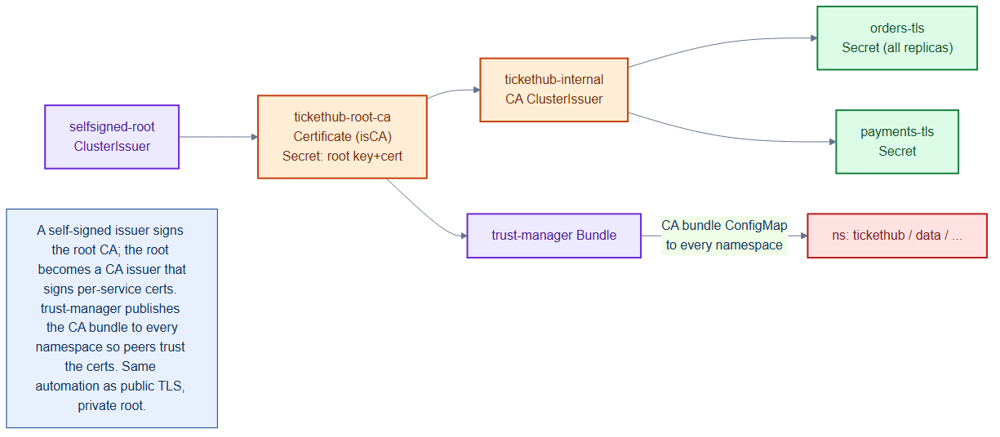

# orders-internal-cert.yaml — per-service internal TLS cert

> **Folder:** `15-pki` · **Chapter:** [Ch 7b — Certificates](../../../docs/07b-certificates.md)

Issues a leaf TLS certificate for the `orders` service from the internal CA, so
orders can serve mTLS to other in-cluster callers.

## Objects in this file

| Kind | Name | Namespace | Key settings |
|---|---|---|---|
| Certificate | `orders-tls` | `tickethub` | secret `orders-tls`, issuer `tickethub-internal`, 90-day ECDSA-256 |

SANs: `orders.tickethub.svc.cluster.local` and
`*.orders-headless.tickethub.svc.cluster.local` (the wildcard covers future
per-pod StatefulSet DNS names).

## How it works

- cert-manager requests the cert from the `tickethub-internal` ClusterIssuer,
  which signs it with the private root CA.
- The signed key pair is stored in the `orders-tls` Secret; the orders
  Deployment mounts it to terminate internal TLS.
- The short 90-day lifetime means cert-manager auto-rotates it well before expiry.

## Relationships

**Interacts with**
- [`internal-ca.yaml`](internal-ca.yaml) — the signing issuer.
- [`../30-workloads/orders-deployment.yaml`](../30-workloads/orders-deployment.yaml) — mounts the `orders-tls` Secret.
- [`trust-bundle.yaml`](trust-bundle.yaml) — lets callers trust this cert's chain.

## Concept

See [Ch 7b — Certificates](../../../docs/07b-certificates.md) for the full walkthrough.
