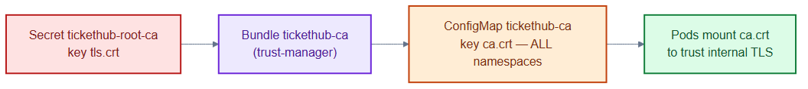

# trust-bundle.yaml — distribute the CA to every namespace

> **Folder:** `15-pki` · **Chapter:** [Ch 7b — Certificates](../../../docs/07b-certificates.md)

Uses trust-manager's `Bundle` to copy the internal root CA into a ConfigMap in
**every** namespace, so any pod can mount `ca.crt` and trust internally-issued
certificates.

## Objects in this file

| Kind | Name | Scope | Source → Target |
|---|---|---|---|
| Bundle | `tickethub-ca` | cluster | Secret `tickethub-root-ca` key `tls.crt` → ConfigMap `tickethub-ca` key `ca.crt` in all namespaces |

## How it works

- trust-manager watches the root CA Secret and materialises a ConfigMap named
  `tickethub-ca` in each namespace.
- Workloads mount that ConfigMap's `ca.crt` into their trust store, so mTLS
  handshakes with services like `orders` validate.
- Rotating the root CA updates every copy automatically — no per-namespace edits.

## Relationships

**Interacts with**
- [`internal-ca.yaml`](internal-ca.yaml) — the source root CA.
- [`orders-internal-cert.yaml`](orders-internal-cert.yaml) — clients validate the `orders-tls` chain against this bundle.

## Concept

See [Ch 7b — Certificates](../../../docs/07b-certificates.md) for the full walkthrough.
