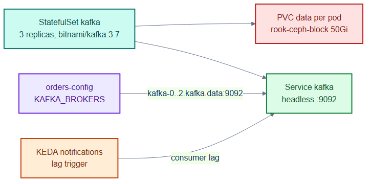
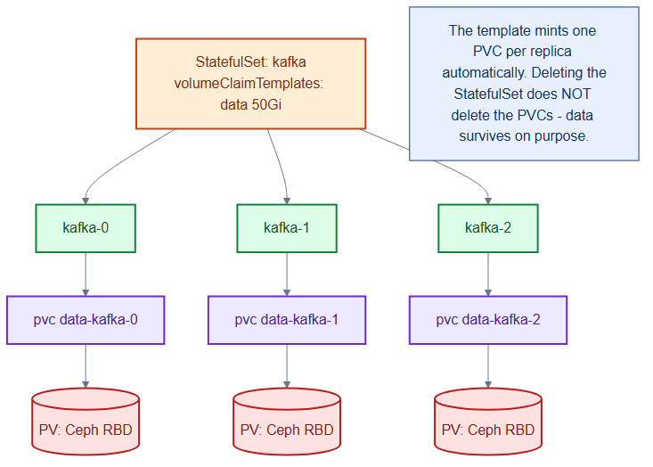

# kafka-statefulset.yaml — the event streaming backbone

> **Folder:** `20-data` · **Chapter:** [Ch 14 — Stateful Storage](../../../docs/14-stateful-storage.md)

Runs Kafka as a 3-broker StatefulSet with per-pod storage and a headless
Service. It carries the asynchronous `ticket-events` stream that decouples
producers (orders) from consumers (notifications).

## Objects in this file

| Kind | Name | Namespace | Key settings |
|---|---|---|---|
| Service | `kafka` | `data` | headless (`clusterIP: None`), selects `app=kafka`, port 9092 |
| StatefulSet | `kafka` | `data` | 3 replicas, `bitnami/kafka:3.7`, `serviceName: kafka` |

Storage: `volumeClaimTemplates → data` on `rook-ceph-block`, 50Gi per broker.

## How it works

- The headless Service yields stable broker DNS
  (`kafka-0.kafka.data:9092`, …) that clients list as bootstrap servers.
- Each broker owns its log directory via a dedicated PVC, so partitions survive
  restarts and rescheduling.
- Three brokers with replicated partitions tolerate a single broker loss.

## Relationships

**Interacts with**
- [`../40-config/configmaps.yaml`](../40-config/configmaps.yaml) — `orders-config` lists these brokers in `KAFKA_BROKERS`.
- [`../50-scaling/notifications-keda.yaml`](../50-scaling/notifications-keda.yaml) — KEDA scales `notifications` on consumer lag against this cluster.
- [`../10-platform/storageclasses.yaml`](../10-platform/storageclasses.yaml) — supplies `rook-ceph-block`.

## Concept

See [Ch 14 — Stateful Storage](../../../docs/14-stateful-storage.md) for the full walkthrough.
