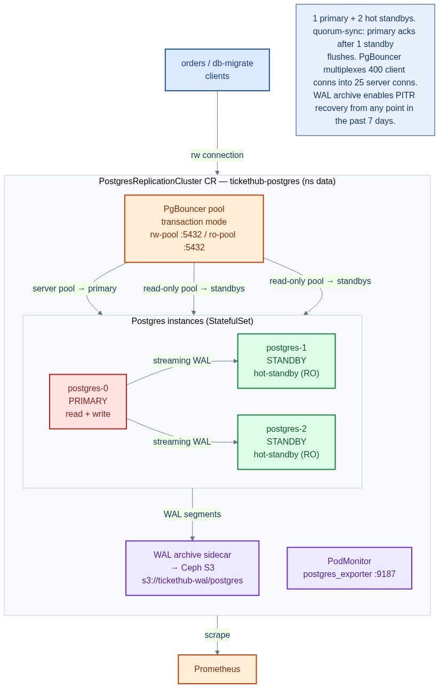
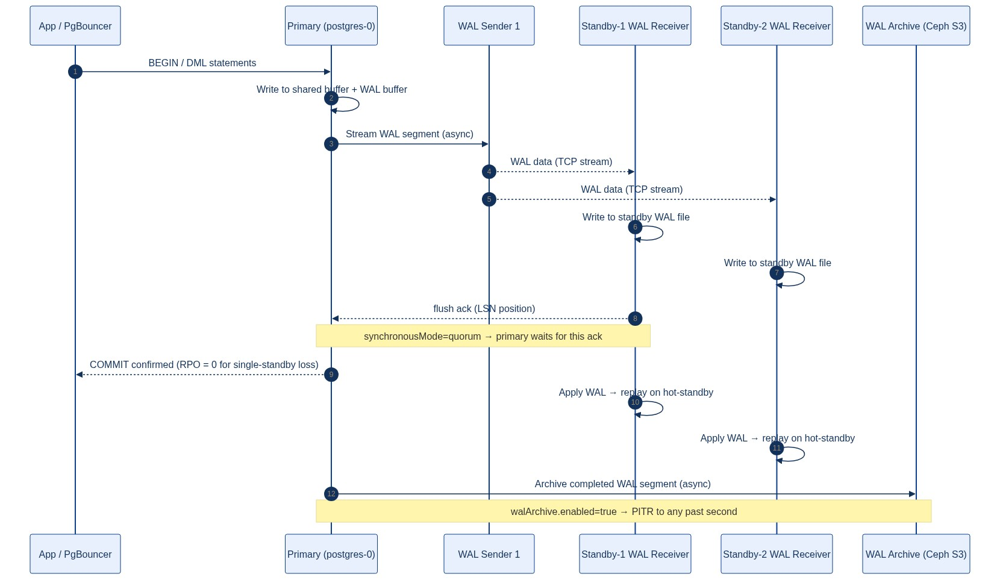
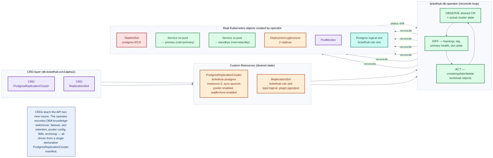
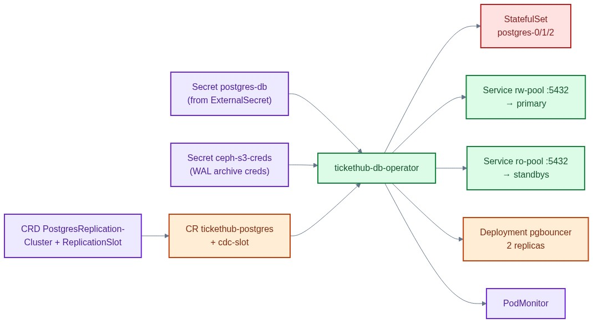

# postgres-replication-crd.yaml — DB replication CRDs + cluster CR

> **Folder:** `20-data` · **Chapters:** [Ch 14 — Stateful Storage](../../../docs/14-stateful-storage.md) · [Ch 25 — CRDs & Operators](../../../docs/25-crds-operators.md)

Defines two CRDs in the `db.tickethub.io` API group that model Postgres
high-availability replication as first-class Kubernetes objects, plus the
RBAC for the `tickethub-db-operator` controller and the live CR for the
TicketHub production cluster.

## Objects in this file

| Kind | Name | Namespace | Purpose |
|---|---|---|---|
| `CustomResourceDefinition` | `postgresreplicationclusters.db.tickethub.io` | cluster-scoped | Registers the `PostgresReplicationCluster` noun |
| `CustomResourceDefinition` | `replicationslots.db.tickethub.io` | cluster-scoped | Registers the `ReplicationSlot` noun |
| `ServiceAccount` | `tickethub-db-operator` | `data` | Identity for the operator controller |
| `ClusterRole` | `tickethub-db-operator` | cluster-scoped | Least-privilege RBAC for the operator |
| `ClusterRoleBinding` | `tickethub-db-operator` | cluster-scoped | Binds role → service account |
| `PostgresReplicationCluster` | `tickethub-postgres` | `data` | Live CR: 1 primary + 2 hot standbys |
| `ReplicationSlot` | `tickethub-cdc-slot` | `data` | Logical CDC slot (pgoutput plugin) |

## Architecture



## How it works

### PostgresReplicationCluster

The CRD lets you declare the *entire* topology of a Postgres HA cluster in one
YAML object. The `tickethub-db-operator` watches `PostgresReplicationCluster`
resources and reconciles them into the real workload objects:

1. **StatefulSet** — one pod per `spec.instances` with a dedicated PVC and
   optional WAL-PVC (`storage.walStorage`).
2. **Read-write Service** → routes to the current primary pod via a label
   selector maintained by the operator (`role=primary`).
3. **Read-only Service** → routes to all standby pods (`role=standby`) when
   `replication.hotStandby: true`.
4. **PgBouncer Deployment** — when `connectionPooler.enabled: true` the
   operator creates a stateless PgBouncer deployment that multiplexes app
   connections onto the smaller server-side pool.
5. **WAL archiver sidecar** — when `walArchive.enabled: true`, a `pgbackrest`
   sidecar streams WAL segments to the Ceph S3 bucket for PITR.
6. **PodMonitor** — when `monitoring.enablePodMonitor: true`, a
   `PodMonitor` pointing at the `postgres_exporter` sidecar is created so
   Prometheus automatically scrapes replication lag, slot health, and
   transaction rate (Chapter 26).

### ReplicationSlot

Physical slots are created automatically for each standby by the operator.
`ReplicationSlot` CRs are for **logical** slots (CDC pipelines). The
`retentionPolicy` is a safety net: an inactive logical slot that accumulates
WAL without a consumer will eventually exhaust disk and crash the primary —
the operator drops the slot and fires an event when either threshold is hit.

### Streaming-replication data flow



```
Primary                      Standby-1               Standby-2
  │ write → WAL buffer         │                        │
  │──── WAL sender ────────────▶ WAL receiver            │
  │                             │ apply WAL              │
  │──── WAL sender ─────────────────────────────────────▶│
  │                                                       │ apply WAL
  │◀── flush ack ─────────────── (quorum mode) ──────────│
  │ commit confirmed to client
```

`synchronousMode: quorum` means the primary only acknowledges a commit after
at least `synchronousStandbys: 1` standby has flushed the WAL to disk — giving
**zero RPO** for a single-standby loss.

### Failover workflow



1. The operator's health-check goroutine fails to reach the primary for
   `promotionTimeout` seconds.
2. The operator ranks standbys by WAL position (lowest lag wins).
3. It runs `pg_promote()` on the chosen standby.
4. It re-labels the promoted pod `role=primary`; the rw-Service endpoint
   flips automatically.
5. It demotes the old primary if it recovers, re-joining as a standby via
   `pg_rewind`.
6. It updates `status.currentPrimary` and fires a Kubernetes `Event`.

## Spec reference

### `spec.replication`

| Field | Default | Meaning |
|---|---|---|
| `synchronousMode` | `none` | `none` / `first` / `quorum` — durability vs latency trade-off |
| `synchronousStandbys` | `1` | Minimum standbys needed for quorum/first ack |
| `walLevel` | `replica` | `logical` required for logical replication slots / CDC |
| `hotStandby` | `true` | Allow read queries on standbys + create RO Service |
| `walKeepSize` | `1Gi` | WAL retained on primary for lagging standbys |
| `maxWalSenders` | `10` | Max concurrent WAL sender processes |

### `spec.failover`

| Field | Default | Meaning |
|---|---|---|
| `automaticFailover` | `true` | Promote best standby on primary loss |
| `promotionTimeout` | `60` | Seconds before promotion fires |
| `primaryUpdateStrategy` | `RollingUpdate` | `Supervised` requires human annotation for major upgrades |

### `spec.connectionPooler`

| Field | Default | Meaning |
|---|---|---|
| `enabled` | `false` | Deploy PgBouncer in front of Postgres |
| `poolMode` | `transaction` | `transaction` recommended for web apps |
| `maxClientConn` | `200` | Client-facing connection limit |
| `defaultPoolSize` | `25` | Server connections per db/user pair |

## Relationships



**Depends on**
- [`../40-config/external-secrets.yaml`](../40-config/external-secrets.yaml) — provisions `postgres-db` Secret from Vault.
- [`../10-platform/storageclasses.yaml`](../10-platform/storageclasses.yaml) — supplies `rook-ceph-block`.

**Consumed by**
- [`../30-workloads/orders-deployment.yaml`](../30-workloads/orders-deployment.yaml) — connects through PgBouncer rw-pool Service.
- [`../30-workloads/db-migrate-job.yaml`](../30-workloads/db-migrate-job.yaml) — runs schema migrations against primary.
- [`../60-security/network-policies.yaml`](../60-security/network-policies.yaml) — restricts Postgres ingress to `orders` only.
- [`../70-observability/orders-monitoring.yaml`](../70-observability/orders-monitoring.yaml) — Prometheus scrapes replication metrics.

## Concept

See [Ch 14 — Stateful Storage §14.6](../../../docs/14-stateful-storage.md#146-db-replication-with-crds) and
[Ch 25 — CRDs & Operators §25.5](../../../docs/25-crds-operators.md#255-db-replication-as-a-crd-domain) for
the full walkthrough.
