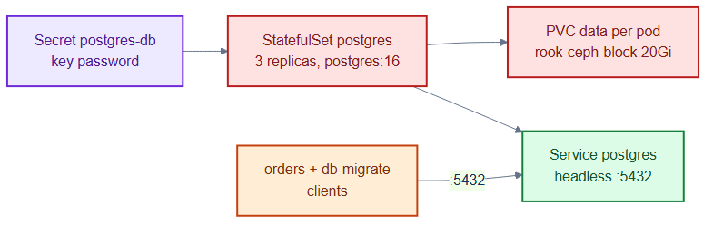
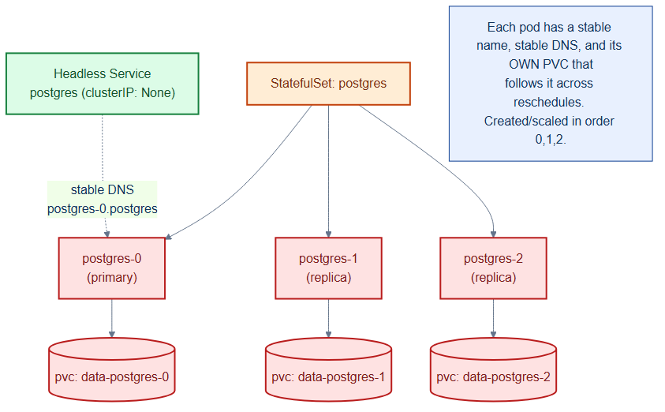

# postgres-statefulset.yaml — the relational database

> **Folder:** `20-data` · **Chapter:** [Ch 14 — Stateful Storage](../../../docs/14-stateful-storage.md)

Runs Postgres as a StatefulSet with stable per-pod identity and per-pod
persistent storage, fronted by a headless Service for stable DNS. This is the
system of record the `orders` service writes to.

## Objects in this file

| Kind | Name | Namespace | Key settings |
|---|---|---|---|
| Service | `postgres` | `data` | headless (`clusterIP: None`), selects `app=postgres`, port 5432 |
| StatefulSet | `postgres` | `data` | 3 replicas, `postgres:16`, `serviceName: postgres` |

Storage: `volumeClaimTemplates → data` on `rook-ceph-block`, 20Gi per pod.
Config: `POSTGRES_PASSWORD` from Secret `postgres-db` key `password`;
`PGDATA=/var/lib/postgresql/data/pgdata`. Readiness probe: `pg_isready`.

## How it works

- The headless Service gives each pod a stable DNS name
  (`postgres-0.postgres.data.svc...`) — essential for stateful clustering.
- Each replica gets its **own** PVC via `volumeClaimTemplates`; data survives
  pod rescheduling because the PVC re-attaches to the new pod.
- Uses the upstream `postgres:16` image directly (no custom Dockerfile) with
  config injected at runtime via env + secret.

## Relationships

**Interacts with**
- [`../40-config/external-secrets.yaml`](../40-config/external-secrets.yaml) — provisions the `postgres-db` Secret from Vault.
- [`../10-platform/storageclasses.yaml`](../10-platform/storageclasses.yaml) — supplies `rook-ceph-block`.
- [`../30-workloads/orders-deployment.yaml`](../30-workloads/orders-deployment.yaml) and [`db-migrate-job.yaml`](../30-workloads/db-migrate-job.yaml) — clients.
- [`../60-security/network-policies.yaml`](../60-security/network-policies.yaml) — only `orders` may reach it on 5432.

## Concept

See [Ch 14 — Stateful Storage](../../../docs/14-stateful-storage.md) for the full walkthrough.
