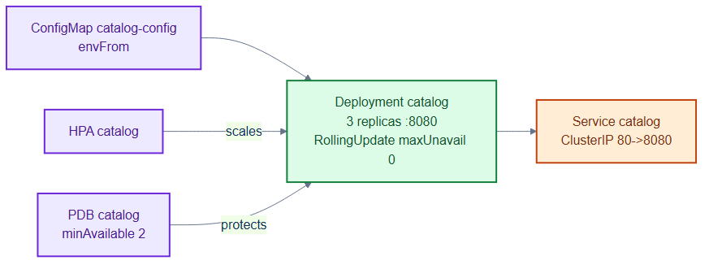

# catalog-deployment.yaml — the catalog service workload

> **Folder:** `30-workloads` · **Chapter:** [Ch 11 — Workload Controllers](../../../docs/11-workload-controllers.md)

A stateless Deployment plus its ClusterIP Service for the `catalog` service,
which serves event listings to the frontend.

## Objects in this file

| Kind | Name | Namespace | Key settings |
|---|---|---|---|
| Deployment | `catalog` | `tickethub` | 3 replicas, `registry.internal/tickethub/catalog:v1`, port 8080, RollingUpdate (maxUnavailable 0, maxSurge 1) |
| Service | `catalog` | `tickethub` | ClusterIP, `app=catalog`, port 80 → targetPort 8080 |

Config via `envFrom: catalog-config`. Probes: readiness `GET /readyz`,
liveness `GET /healthz`.

## How it works

- The Deployment keeps 3 identical replicas; `maxUnavailable: 0` means rollouts
  add a new pod before removing an old one (zero-downtime).
- The Service load-balances port 80 across ready pods on 8080; readiness gates
  traffic until `/readyz` passes.
- Runnable reference implementation: [`repo/services/catalog`](../../services/catalog).

## Relationships

**Interacts with**
- [`../40-config/configmaps.yaml`](../40-config/configmaps.yaml) — `catalog-config` (SEARCH_URL).
- [`../50-scaling/catalog-hpa.yaml`](../50-scaling/catalog-hpa.yaml) and [`pdb.yaml`](../50-scaling/pdb.yaml) — scale and protect it.

## Concept

See [Ch 11 — Workload Controllers](../../../docs/11-workload-controllers.md) for the full walkthrough.
