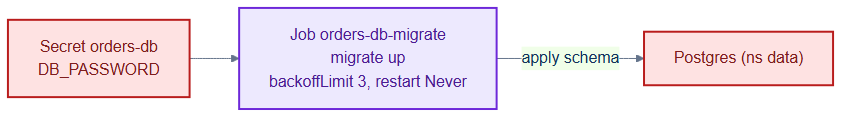
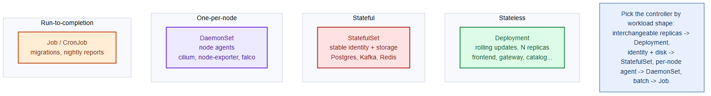

# db-migrate-job.yaml — run schema migrations once

> **Folder:** `30-workloads` · **Chapter:** [Ch 11 — Workload Controllers](../../../docs/11-workload-controllers.md)

A one-shot Job that applies database schema migrations before/around an orders
release. Jobs run to completion instead of running forever like a Deployment.

## Objects in this file

| Kind | Name | Namespace | Key settings |
|---|---|---|---|
| Job | `orders-db-migrate` | `tickethub` | `registry.internal/tickethub/orders-migrate:v1`, command `/migrate up`, `backoffLimit: 3`, `restartPolicy: Never` |

Config: `DB_PASSWORD` from Secret `orders-db` key `DB_PASSWORD`.

## How it works

- The Job creates a pod that runs `migrate up` against Postgres and exits.
- `restartPolicy: Never` + `backoffLimit: 3` means up to 3 attempts on failure,
  then the Job is marked failed (surfacing a broken migration instead of looping).
- Typically wired as an Argo CD PreSync hook so migrations land before new
  orders pods roll out.

## Relationships

**Interacts with**
- [`../40-config/external-secrets.yaml`](../40-config/external-secrets.yaml) — provisions the `orders-db` Secret.
- [`../20-data/postgres-statefulset.yaml`](../20-data/postgres-statefulset.yaml) — the target database.
- [`orders-deployment.yaml`](orders-deployment.yaml) — the app whose schema this prepares.

## Concept

See [Ch 11 — Workload Controllers](../../../docs/11-workload-controllers.md) for the full walkthrough.
