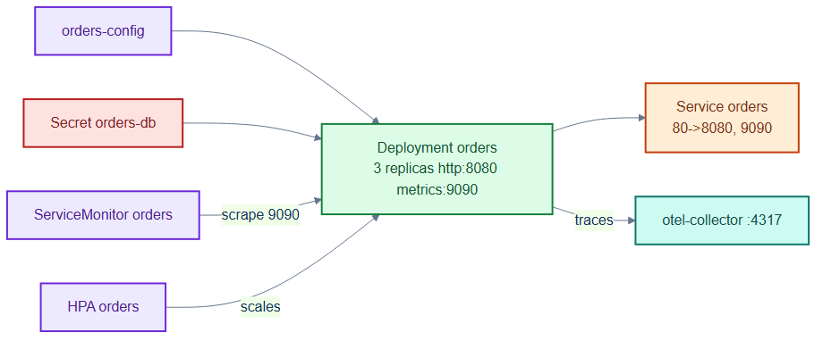
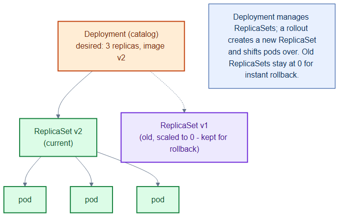

# orders-deployment.yaml — the orders service workload

> **Folder:** `30-workloads` · **Chapter:** [Ch 11 — Workload Controllers](../../../docs/11-workload-controllers.md)

The most connected workload in TicketHub: the `orders` Deployment plus a Service
that exposes both an HTTP port and a Prometheus metrics port. It reads config
and a DB secret, emits traces, and is scaled, scraped, and firewalled by other
manifests.

## Objects in this file

| Kind | Name | Namespace | Key settings |
|---|---|---|---|
| Deployment | `orders` | `tickethub` | 3 replicas, `registry.internal/tickethub/orders:v1`, ports http 8080 + metrics 9090, RollingUpdate (maxUnavailable 0, maxSurge 1) |
| Service | `orders` | `tickethub` | ClusterIP, `app=orders`, http 80→8080, metrics 9090 |

Config: `envFrom: orders-config`; `DB_PASSWORD` from Secret `orders-db`;
`OTEL_EXPORTER_OTLP_ENDPOINT=otel-collector.monitoring:4317`. Probes:
readiness `/readyz`, liveness `/healthz`.

## How it works

- Separates the app port (8080, behind the Service) from the metrics port
  (9090, scraped by Prometheus) so metrics aren't exposed to normal callers.
- Pulls plaintext config from a ConfigMap and the DB password from a Secret,
  and ships traces to the OTel collector.
- Runnable reference implementation (Go): [`repo/services/orders`](../../services/orders).

## Relationships

**Interacts with**
- [`../40-config/configmaps.yaml`](../40-config/configmaps.yaml) + [`external-secrets.yaml`](../40-config/external-secrets.yaml) — config and DB secret.
- [`../50-scaling/orders-hpa-custom.yaml`](../50-scaling/orders-hpa-custom.yaml) + [`pdb.yaml`](../50-scaling/pdb.yaml) — scale/protect.
- [`../70-observability/orders-monitoring.yaml`](../70-observability/orders-monitoring.yaml) + [`otel-collector-tempo.yaml`](../70-observability/otel-collector-tempo.yaml) — metrics + traces.
- [`../60-security/network-policies.yaml`](../60-security/network-policies.yaml) + [`orders-rbac.yaml`](../60-security/orders-rbac.yaml) + [`../15-pki/orders-internal-cert.yaml`](../15-pki/orders-internal-cert.yaml) — network, RBAC, TLS.

## Concept

See [Ch 11 — Workload Controllers](../../../docs/11-workload-controllers.md) and
[Ch 12 — Services & Traffic](../../../docs/12-services-traffic.md) for the full walkthrough.
