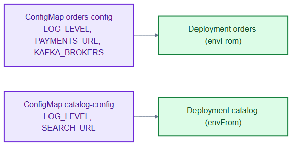
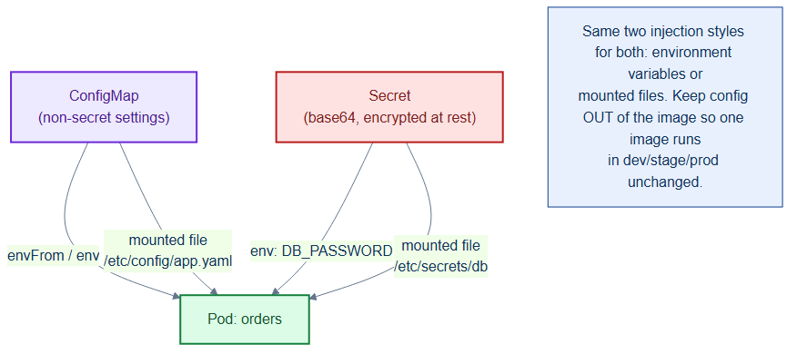

# configmaps.yaml — non-secret runtime configuration

> **Folder:** `40-config` · **Chapter:** [Ch 13 — Config & Secrets](../../../docs/13-config-secrets.md)

Holds the plaintext, non-sensitive configuration injected into the app services
as environment variables — service URLs, log levels, and broker lists.

## Objects in this file

| Kind | Name | Namespace | Data |
|---|---|---|---|
| ConfigMap | `orders-config` | `tickethub` | `LOG_LEVEL`, `PAYMENTS_URL`, `KAFKA_BROKERS` |
| ConfigMap | `catalog-config` | `tickethub` | `LOG_LEVEL`, `SEARCH_URL` |

## How it works

- Deployments consume these via `envFrom`, so every key becomes an env var in
  the container — no image rebuild needed to change config.
- `KAFKA_BROKERS` encodes the headless Kafka DNS names, and `PAYMENTS_URL` /
  `SEARCH_URL` use in-cluster Service DNS — this is how services discover each
  other.
- Secrets (passwords) are deliberately kept out of here; see
  [`external-secrets.yaml`](external-secrets.yaml).

## Relationships

**Interacts with**
- [`../30-workloads/orders-deployment.yaml`](../30-workloads/orders-deployment.yaml) and [`catalog-deployment.yaml`](../30-workloads/catalog-deployment.yaml) — consumers.
- [`../20-data/kafka-statefulset.yaml`](../20-data/kafka-statefulset.yaml) — the brokers named in `KAFKA_BROKERS`.

## Concept

See [Ch 13 — Config & Secrets](../../../docs/13-config-secrets.md) for the full walkthrough.
