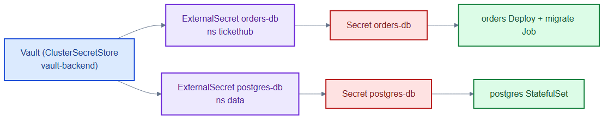
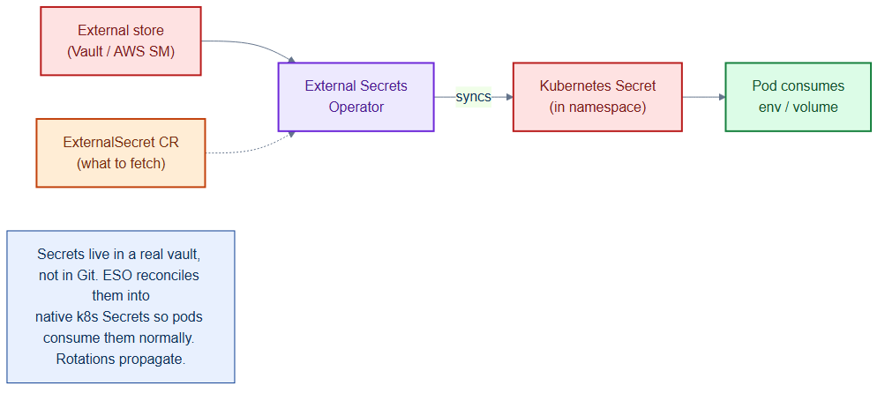

# external-secrets.yaml — pull secrets from Vault

> **Folder:** `40-config` · **Chapter:** [Ch 13 — Config & Secrets](../../../docs/13-config-secrets.md)

Instead of committing passwords to Git, these `ExternalSecret`s tell the
External Secrets Operator to fetch values from Vault and materialise them as
native Kubernetes Secrets.

## Objects in this file

| Kind | Name | Namespace | Source → Target |
|---|---|---|---|
| ExternalSecret | `orders-db` | `tickethub` | Vault `tickethub/orders` prop `db_password` → Secret `orders-db` key `DB_PASSWORD` |
| ExternalSecret | `postgres-db` | `data` | Vault `tickethub/postgres` prop `password` → Secret `postgres-db` key `password` |

Both reference the `vault-backend` ClusterSecretStore, refresh every 1h.

## How it works

- The operator authenticates to Vault, reads the property, and writes/refreshes
  a normal Secret every hour — so rotating a value in Vault propagates
  automatically.
- The Git repo only stores the *reference*, never the secret material.

## Relationships

**Interacts with**
- [`../30-workloads/orders-deployment.yaml`](../30-workloads/orders-deployment.yaml) + [`db-migrate-job.yaml`](../30-workloads/db-migrate-job.yaml) — consume Secret `orders-db`.
- [`../20-data/postgres-statefulset.yaml`](../20-data/postgres-statefulset.yaml) — consumes Secret `postgres-db`.

## Concept

See [Ch 13 — Config & Secrets](../../../docs/13-config-secrets.md) and
[Ch 24 — Secrets & Supply Chain](../../../docs/24-secrets-supply-chain.md) for the full walkthrough.
