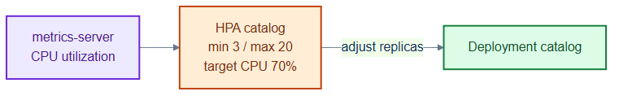
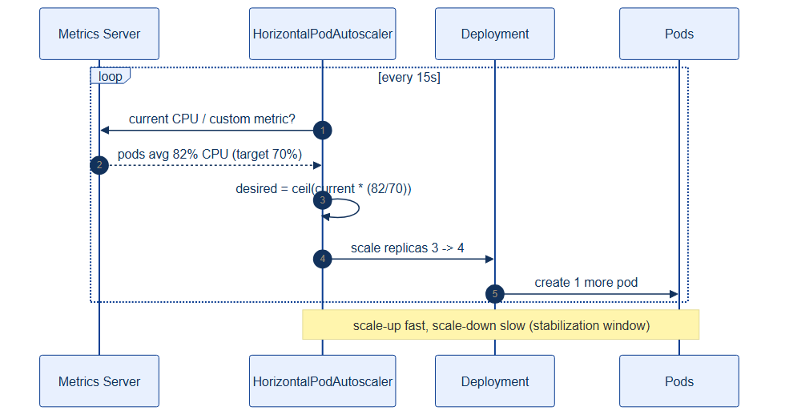

# catalog-hpa.yaml — CPU-based horizontal autoscaling

> **Folder:** `50-scaling` · **Chapter:** [Ch 16 — Autoscaling](../../../docs/16-autoscaling.md)

Scales the `catalog` Deployment horizontally based on CPU utilization — the
simplest, most common autoscaling signal.

## Objects in this file

| Kind | Name | Namespace | Key settings |
|---|---|---|---|
| HorizontalPodAutoscaler | `catalog` | `tickethub` | target Deployment `catalog`, min 3 / max 20, CPU 70% |

Behaviour: fast scale-up (0s stabilization), cautious scale-down (300s).

## How it works

- The HPA reads CPU from metrics-server and compares to the 70% target,
  adjusting replica count to keep utilization near target.
- Asymmetric behaviour absorbs spikes quickly but avoids flapping when load drops.
- Scaling is bounded above by the namespace ResourceQuota.

## Relationships

**Interacts with**
- [`../30-workloads/catalog-deployment.yaml`](../30-workloads/catalog-deployment.yaml) — the scale target (must declare CPU requests).
- [`pdb.yaml`](pdb.yaml) — keeps a floor of available pods during disruptions.

## Concept

See [Ch 16 — Autoscaling](../../../docs/16-autoscaling.md) for the full walkthrough.
