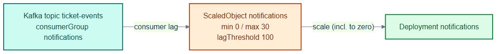

# notifications-keda.yaml — event-driven, scale-to-zero autoscaling

> **Folder:** `50-scaling` · **Chapter:** [Ch 16 — Autoscaling](../../../docs/16-autoscaling.md)

A KEDA `ScaledObject` that scales the `notifications` worker on Kafka consumer
lag — including all the way down to **zero** when the topic is idle.

## Objects in this file

| Kind | Name | Namespace | Key settings |
|---|---|---|---|
| ScaledObject | `notifications` | `tickethub` | target Deployment `notifications`, min 0 / max 30, poll 15s, cooldown 120s |

Trigger: Kafka, `bootstrapServers: kafka-0.kafka.data:9092`, consumer group
`notifications`, topic `ticket-events`, `lagThreshold: 100`.

## How it works

- KEDA polls Kafka for consumer-group lag; when lag exceeds 100 it adds pods,
  and when the backlog clears it scales back to zero (no idle cost).
- This is the async counterpart to CPU-based HPA — it scales on queue depth, not
  request rate.

## Relationships

**Interacts with**
- [`../20-data/kafka-statefulset.yaml`](../20-data/kafka-statefulset.yaml) — the Kafka cluster whose lag drives scaling.
- The `notifications` Deployment (see [`repo/services/notifications`](../../services/notifications)).

## Concept

See [Ch 16 — Autoscaling](../../../docs/16-autoscaling.md) for the full walkthrough.
