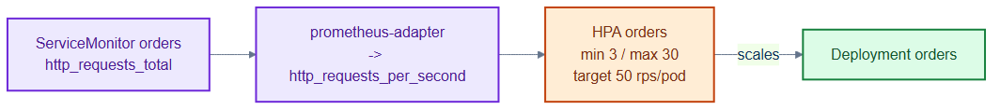

# orders-hpa-custom.yaml — autoscaling on a custom metric

> **Folder:** `50-scaling` · **Chapter:** [Ch 16 — Autoscaling](../../../docs/16-autoscaling.md)

Scales the `orders` Deployment on a business-relevant custom metric —
requests-per-second per pod — instead of CPU.

## Objects in this file

| Kind | Name | Namespace | Key settings |
|---|---|---|---|
| HorizontalPodAutoscaler | `orders` | `tickethub` | target Deployment `orders`, min 3 / max 30, Pods metric `http_requests_per_second` = 50/pod |

Scale-down stabilization: 300s.

## How it works

- The HPA reads `http_requests_per_second` from the custom metrics API, which is
  served by prometheus-adapter from Prometheus data.
- Targeting rps-per-pod keeps latency stable under bursty traffic where CPU
  alone would lag.

## Relationships

**Interacts with**
- [`prometheus-adapter-config.yaml`](prometheus-adapter-config.yaml) — turns the raw counter into the rate metric this HPA reads.
- [`../70-observability/orders-monitoring.yaml`](../70-observability/orders-monitoring.yaml) — the ServiceMonitor that feeds Prometheus.
- [`../30-workloads/orders-deployment.yaml`](../30-workloads/orders-deployment.yaml) — the scale target.

## Concept

See [Ch 16 — Autoscaling](../../../docs/16-autoscaling.md) for the full walkthrough.
