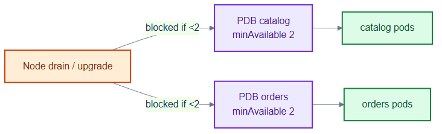
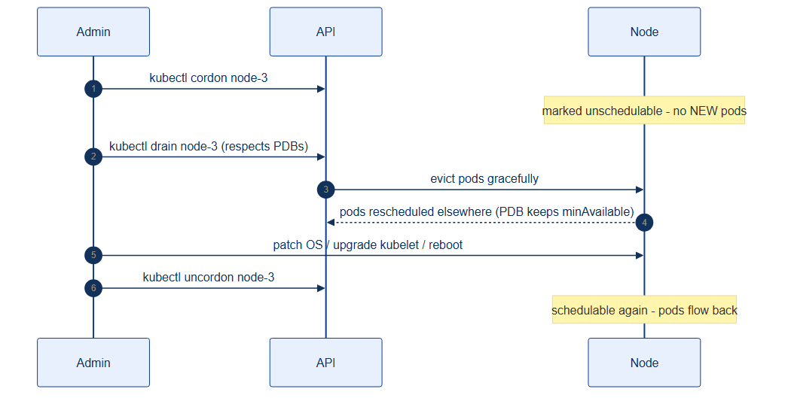

# pdb.yaml — keep a minimum of pods during disruptions

> **Folder:** `50-scaling` · **Chapter:** [Ch 16 — Autoscaling](../../../docs/16-autoscaling.md)

PodDisruptionBudgets guarantee a floor of available replicas during *voluntary*
disruptions (node drains, upgrades), so autoscaling and rollouts can't take a
service fully offline.

## Objects in this file

| Kind | Name | Namespace | Key settings |
|---|---|---|---|
| PodDisruptionBudget | `catalog` | `tickethub` | `minAvailable: 2`, selects `app=catalog` |
| PodDisruptionBudget | `orders` | `tickethub` | `minAvailable: 2`, selects `app=orders` |

## How it works

- When you `kubectl drain` a node, the eviction API refuses to evict a pod if
  doing so would drop the service below `minAvailable`.
- This forces drains/upgrades to proceed one pod at a time and wait for
  replacements — protecting availability without blocking maintenance entirely.
- PDBs constrain only *voluntary* disruptions, not crashes.

## Relationships

**Interacts with**
- [`../30-workloads/catalog-deployment.yaml`](../30-workloads/catalog-deployment.yaml) and [`orders-deployment.yaml`](../30-workloads/orders-deployment.yaml) — the protected workloads.
- [`../70-observability/velero-schedule.yaml`](../70-observability/velero-schedule.yaml) and node upgrades — the maintenance operations PDBs guard against.

## Concept

See [Ch 16 — Autoscaling](../../../docs/16-autoscaling.md) and
[Ch 27 — Backup, DR & Upgrades](../../../docs/27-backup-dr-upgrades.md) for the full walkthrough.
