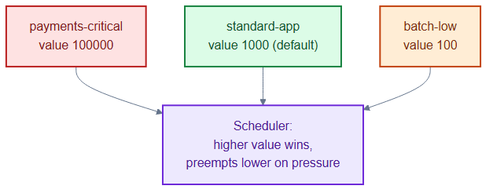
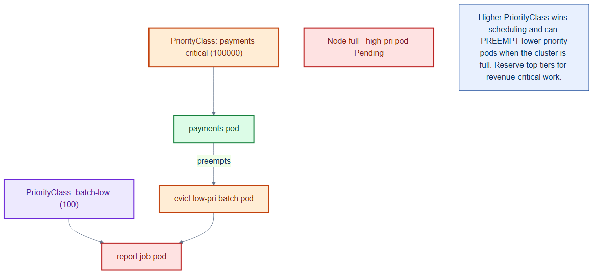

# priorityclasses.yaml — scheduling priority tiers

> **Folder:** `50-scaling` · **Chapter:** [Ch 17 — Scheduling & Placement](../../../docs/17-scheduling-placement.md)

Three cluster-wide `PriorityClass`es that rank workloads so the scheduler knows
what to place first and, under resource pressure, what to preempt.

## Objects in this file

| Kind | Name | Value | Use |
|---|---|---|---|
| PriorityClass | `payments-critical` | 100000 | revenue-critical (payments, orders, gateway) |
| PriorityClass | `standard-app` | 1000 (globalDefault) | default for stateless services |
| PriorityClass | `batch-low` | 100 | reports, reindex, migrations — preempted first |

## How it works

- A pod's `priorityClassName` sets its scheduling priority; higher-value pods are
  scheduled ahead of lower ones and can **preempt** (evict) them when the cluster
  is full.
- `standard-app` is `globalDefault: true`, so pods that don't specify a class get
  it automatically.
- This protects revenue-path services when capacity is tight.

## Relationships

**Interacts with**
- Workloads in [`../30-workloads/`](../30-workloads/) — set `priorityClassName` to one of these.
- [`../00-namespaces/quota-limits.yaml`](../00-namespaces/quota-limits.yaml) — priority + quota together govern who runs under pressure.

## Concept

See [Ch 17 — Scheduling & Placement](../../../docs/17-scheduling-placement.md) for the full walkthrough.
