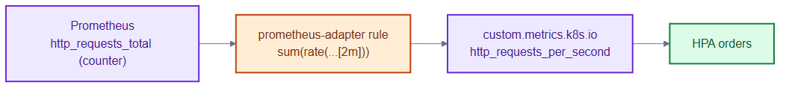
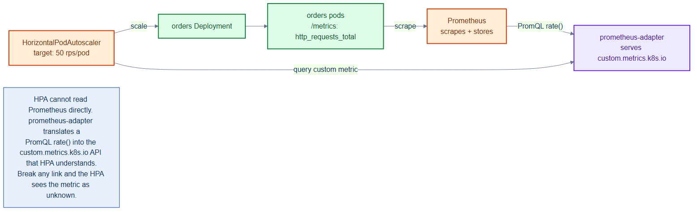

# prometheus-adapter-config.yaml — expose Prometheus metrics to HPA

> **Folder:** `50-scaling` · **Chapter:** [Ch 16 — Autoscaling](../../../docs/16-autoscaling.md)

Configuration rules for prometheus-adapter that translate a raw Prometheus
counter into a rate metric on the Kubernetes custom-metrics API, so an HPA can
scale on it.

## What it configures

| Piece | Purpose |
|---|---|
| seriesQuery | selects `http_requests_total{namespace!="",pod!=""}` |
| metricsQuery | `sum(rate(<<.Series>>{...}[2m])) by (<<.GroupBy>>)` → `http_requests_per_second` |

## How it works

- prometheus-adapter registers as the `custom.metrics.k8s.io` API server.
- Its rule reads the cumulative `http_requests_total` counter and computes a
  2-minute rate, publishing `http_requests_per_second` per pod.
- The HPA then queries that metric name as if it were built in.

## Relationships

**Interacts with**
- [`orders-hpa-custom.yaml`](orders-hpa-custom.yaml) — the consumer of the derived metric.
- [`../70-observability/orders-monitoring.yaml`](../70-observability/orders-monitoring.yaml) — the ServiceMonitor producing `http_requests_total` in Prometheus.

## Concept

See [Ch 16 — Autoscaling](../../../docs/16-autoscaling.md) for the full walkthrough.
