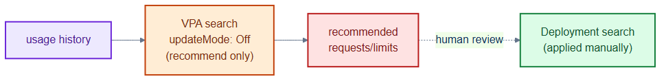
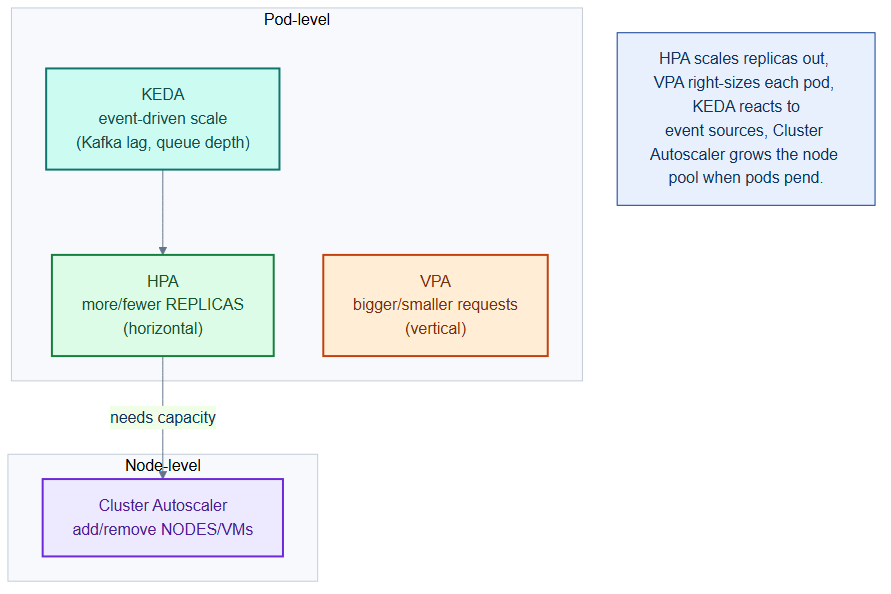

# search-vpa.yaml — right-size requests with a Vertical Pod Autoscaler

> **Folder:** `50-scaling` · **Chapter:** [Ch 16 — Autoscaling](../../../docs/16-autoscaling.md)

A VerticalPodAutoscaler in **recommend-only** mode for the `search` service. It
observes usage and suggests better CPU/memory requests without changing pods
automatically.

## Objects in this file

| Kind | Name | Namespace | Key settings |
|---|---|---|---|
| VerticalPodAutoscaler | `search` | `tickethub` | target Deployment `search`, `updateMode: Off` |

## How it works

- The VPA recommender watches actual CPU/memory usage and produces recommended
  requests/limits, visible via `kubectl describe vpa search`.
- `updateMode: Off` means it never evicts or mutates pods — a human reviews the
  recommendation and applies it. This avoids VPA/HPA conflicts on the same
  resource.

## Relationships

**Interacts with**
- The `search` Deployment (see [`repo/services/search`](../../services/search)) — the observed/target workload.
- [`../00-namespaces/quota-limits.yaml`](../00-namespaces/quota-limits.yaml) — recommendations should stay within namespace limits.

## Concept

See [Ch 16 — Autoscaling](../../../docs/16-autoscaling.md) for the full walkthrough.
