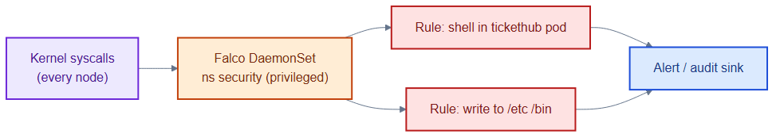
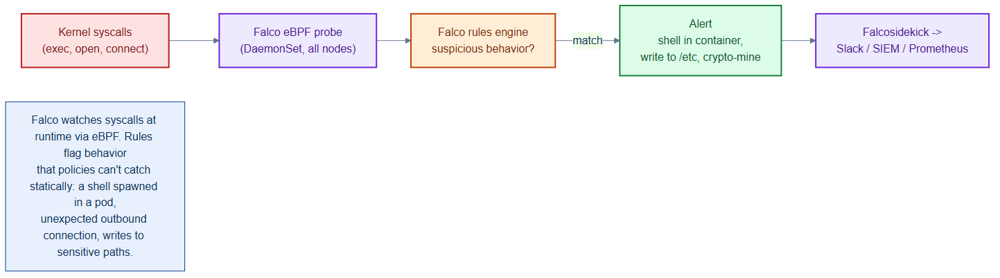

# falco-rules.yaml — runtime threat detection rules

> **Folder:** `60-security` · **Chapter:** [Ch 23 — Falco](../../../docs/23-falco.md)

Custom Falco rules that watch kernel syscalls at runtime and alert on suspicious
behaviour inside TicketHub pods — the detective control that complements the
preventive admission policies.

## What it defines

| Rule | Condition | Priority |
|---|---|---|
| Shell spawned in TicketHub container | a shell (`bash/sh/zsh/ash`) runs in a `tickethub` pod | WARNING |
| Write below sensitive dir | `open_write` under `/etc` or `/bin` in a `tickethub` pod | ERROR |

Falco itself runs as a privileged DaemonSet in the `security` namespace.

## How it works

- Falco taps kernel syscalls on every node and evaluates them against these
  rules in real time.
- A shell in a production pod or a write to `/etc` usually signals a breach or
  drift, so these fire alerts to the security sink.
- This catches what admission control can't — behaviour *after* a pod is running.

## Relationships

**Interacts with**
- [`../00-namespaces/namespaces.yaml`](../00-namespaces/namespaces.yaml) — Falco runs in the `privileged` `security` namespace and watches `tickethub`.
- [`kyverno-policies.yaml`](kyverno-policies.yaml) — Kyverno prevents at admission; Falco detects at runtime.

## Concept

See [Ch 23 — Falco](../../../docs/23-falco.md) for the full walkthrough.
