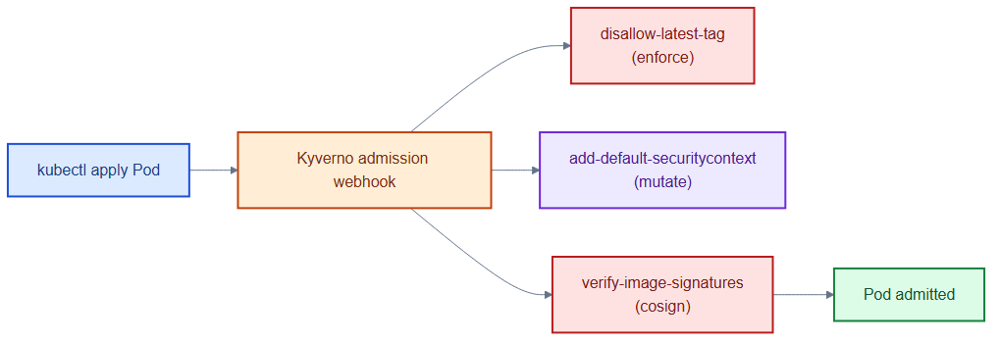
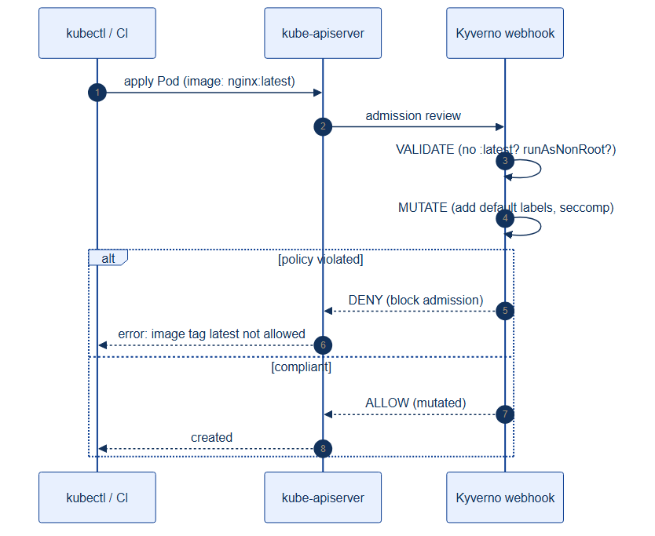

# kyverno-policies.yaml — admission-time policy enforcement

> **Folder:** `60-security` · **Chapter:** [Ch 22 — Kyverno](../../../docs/22-kyverno.md)

Three Kyverno `ClusterPolicy`s that validate and mutate pods at admission —
blocking bad configurations before they ever run.

## Objects in this file

| Kind | Name | Action | Effect |
|---|---|---|---|
| ClusterPolicy | `disallow-latest-tag` | validate (Enforce) | reject `:latest`/untagged images |
| ClusterPolicy | `add-default-securitycontext` | mutate | inject `seccompProfile: RuntimeDefault` on `tickethub` pods |
| ClusterPolicy | `verify-image-signatures` | verifyImages (Enforce) | require Cosign signature on `registry.internal/tickethub/*` |

## How it works

- Kyverno runs as an admission webhook: `validate` rules reject non-compliant
  resources, `mutate` rules patch them, `verifyImages` checks signatures against
  a public key.
- `disallow-latest-tag` guarantees reproducible, pinned images; the mutate rule
  hardens every pod by default; signature verification blocks unsigned/ tampered
  images (supply-chain defense).

## Relationships

**Interacts with**
- All workloads in [`../30-workloads/`](../30-workloads/) — every pod passes through these gates.
- [`../10-platform/registry-pull-secret.yaml`](../10-platform/registry-pull-secret.yaml) — the registry whose images must be signed.
- [Ch 24 — Secrets & Supply Chain](../../../docs/24-secrets-supply-chain.md) — the Cosign signing pipeline behind `verify-image-signatures`.

## Concept

See [Ch 22 — Kyverno](../../../docs/22-kyverno.md) for the full walkthrough.
