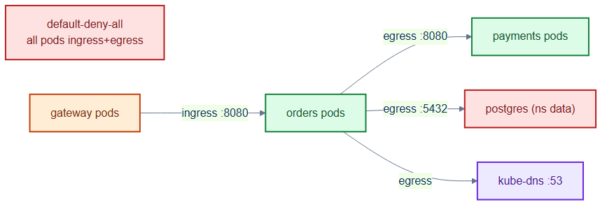
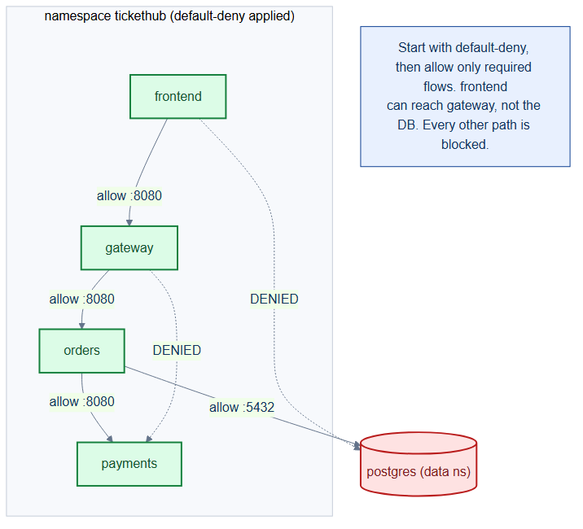

# network-policies.yaml — zero-trust pod networking

> **Folder:** `60-security` · **Chapter:** [Ch 21 — Network Policies](../../../docs/21-network-policies.md)

Establishes a default-deny baseline for the `tickethub` namespace and then opens
only the exact flows `orders` needs — the least-privilege network model.

## Objects in this file

| Kind | Name | Namespace | Effect |
|---|---|---|---|
| NetworkPolicy | `default-deny-all` | `tickethub` | selects all pods, denies all ingress + egress |
| NetworkPolicy | `orders-allow` | `tickethub` | explicit allow-list for `app=orders` |

`orders-allow` permits: **ingress** from `app=gateway` on 8080; **egress** to
`app=payments` on 8080, to `app=postgres` in namespace `data` on 5432, and DNS
(UDP/TCP 53).

## How it works

- With a CNI that enforces NetworkPolicy (Cilium here), `default-deny-all` drops
  every packet not explicitly allowed.
- `orders-allow` then re-enables just the required paths, so a compromised pod
  can't pivot laterally.
- DNS egress must be allowed explicitly, or name resolution breaks under
  default-deny — a common gotcha.

## Relationships

**Interacts with**
- [`../30-workloads/orders-deployment.yaml`](../30-workloads/orders-deployment.yaml) — the `app=orders` pods governed here.
- [`../20-data/postgres-statefulset.yaml`](../20-data/postgres-statefulset.yaml) — the cross-namespace egress target on 5432.
- [`../00-namespaces/namespaces.yaml`](../00-namespaces/namespaces.yaml) — the `data` namespace label used as an egress peer.

## Concept

See [Ch 21 — Network Policies](../../../docs/21-network-policies.md) for the full walkthrough.
