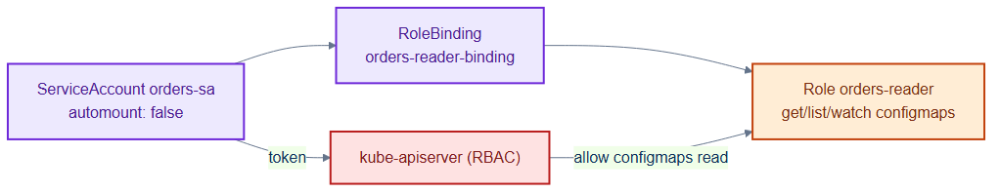
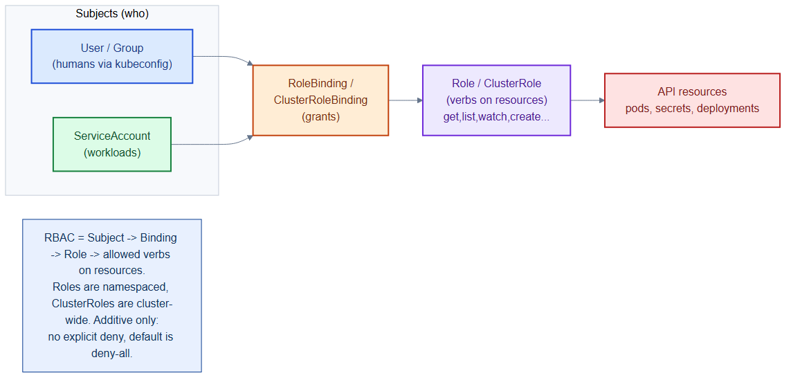

# orders-rbac.yaml — least-privilege API access for orders

> **Folder:** `60-security` · **Chapter:** [Ch 19 — RBAC](../../../docs/19-rbac.md)

A dedicated ServiceAccount plus a narrowly-scoped Role/RoleBinding for the
`orders` service — the identity and permissions it uses against the Kubernetes
API (as opposed to network access, which lives in the NetworkPolicy).

## Objects in this file

| Kind | Name | Namespace | Grant |
|---|---|---|---|
| ServiceAccount | `orders-sa` | `tickethub` | `automountServiceAccountToken: false` |
| Role | `orders-reader` | `tickethub` | `get/list/watch` on `configmaps` |
| RoleBinding | `orders-reader-binding` | `tickethub` | binds `orders-sa` → `orders-reader` |

## How it works

- The Role grants only read access to ConfigMaps in one namespace — nothing else.
- `automountServiceAccountToken: false` means the token isn't mounted unless a
  pod explicitly opts in, shrinking the attack surface.
- To use it, the orders Deployment would set `spec.serviceAccountName: orders-sa`
  (the binding then applies).

## Relationships

**Interacts with**
- [`../30-workloads/orders-deployment.yaml`](../30-workloads/orders-deployment.yaml) — the workload that would run under `orders-sa`.
- [`../40-config/configmaps.yaml`](../40-config/configmaps.yaml) — the only resource this Role can read.

## Concept

See [Ch 19 — RBAC](../../../docs/19-rbac.md) for the full walkthrough.
