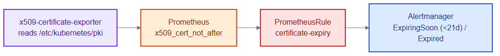

# cert-expiry-rule.yaml — alert before certificates expire

> **Folder:** `70-observability` · **Chapter:** [Ch 26 — Observability](../../../docs/26-observability.md)

A PrometheusRule that pages operators when control-plane certificates approach
expiry — turning a silent, catastrophic failure mode into an early warning.

## Objects in this file

| Kind | Name | Namespace | Alerts |
|---|---|---|---|
| PrometheusRule | `certificate-expiry` | `monitoring` | `ControlPlaneCertExpiringSoon` (<21 days), `ControlPlaneCertExpired` (<0) |

Expr uses `x509_cert_not_after - time()` from the x509-certificate-exporter.

## How it works

- The x509-certificate-exporter DaemonSet reads `/etc/kubernetes/pki` on control
  nodes and exposes each cert's expiry as a Prometheus gauge.
- The rule fires a `page`-severity alert three weeks out, and `critical` once a
  cert has actually expired.
- This guards against the classic outage where kubelet/apiserver certs silently
  lapse.

## Relationships

**Interacts with**
- [`../10-platform/cert-manager-issuers.yaml`](../10-platform/cert-manager-issuers.yaml) and [`../15-pki/`](../15-pki/) — the certs whose lifecycles this watches.
- [`orders-monitoring.yaml`](orders-monitoring.yaml) — sibling PrometheusRule for app SLOs.

## Concept

See [Ch 26 — Observability](../../../docs/26-observability.md) and
[Ch 7b — Certificates](../../../docs/07b-certificates.md) for the full walkthrough.
