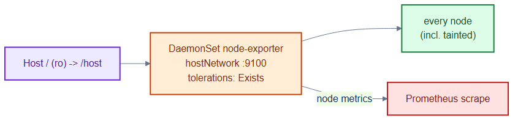
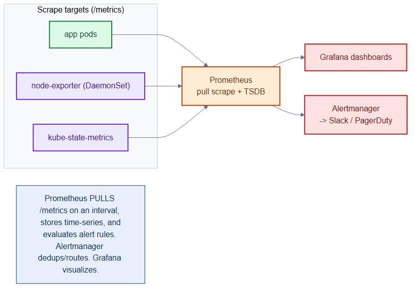

# node-exporter-daemonset.yaml — per-node hardware metrics

> **Folder:** `70-observability` · **Chapter:** [Ch 26 — Observability](../../../docs/26-observability.md)

A DaemonSet that runs Prometheus node-exporter on **every** node — including
tainted data/infra/control-plane nodes — to expose CPU, memory, disk, and
network metrics for the host itself.

## Objects in this file

| Kind | Name | Namespace | Key settings |
|---|---|---|---|
| DaemonSet | `node-exporter` | `monitoring` | `quay.io/prometheus/node-exporter:v1.8.0`, `hostNetwork: true`, port 9100, `--path.rootfs=/host` |

Tolerations: `operator: Exists` (runs on all nodes); host `/` mounted read-only
at `/host`.

## How it works

- A DaemonSet guarantees exactly one pod per node — the right controller for
  node-level agents.
- `tolerations: Exists` lets it schedule onto tainted nodes that normal
  workloads avoid, so no node is a monitoring blind spot.
- It reads the host filesystem read-only and publishes metrics on 9100 for
  Prometheus to scrape.

## Relationships

**Interacts with**
- [`orders-monitoring.yaml`](orders-monitoring.yaml) — app-level metrics counterpart (this is node-level).
- [`../50-scaling/priorityclasses.yaml`](../50-scaling/priorityclasses.yaml) / taints — tolerations let it land on tainted nodes.

## Concept

See [Ch 26 — Observability](../../../docs/26-observability.md) for the full walkthrough.
