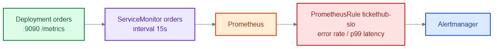

# orders-monitoring.yaml — scrape config and SLO alerts for orders

> **Folder:** `70-observability` · **Chapter:** [Ch 26 — Observability](../../../docs/26-observability.md)

Tells Prometheus how to scrape the `orders` metrics endpoint and defines
service-level objective alerts on its error rate and latency.

## Objects in this file

| Kind | Name | Namespace | Purpose |
|---|---|---|---|
| ServiceMonitor | `orders` | `tickethub` | scrape `app=orders` port `metrics` every 15s |
| PrometheusRule | `tickethub-slo` | `tickethub` | `OrdersHighErrorRate` (>2% 5xx for 5m), `OrdersHighLatency` (p99 > 1s for 10m) |

Both carry `release: kube-prometheus-stack` so the Prometheus operator selects them.

## How it works

- The ServiceMonitor is how the Prometheus operator discovers the orders metrics
  port (9090) — no manual scrape config.
- The PrometheusRule turns raw metrics into actionable SLO alerts on error budget
  burn and tail latency.
- The same `http_requests_total` series also feeds the custom-metric HPA.

## Relationships

**Interacts with**
- [`../30-workloads/orders-deployment.yaml`](../30-workloads/orders-deployment.yaml) — exposes the `metrics` port scraped here.
- [`../50-scaling/orders-hpa-custom.yaml`](../50-scaling/orders-hpa-custom.yaml) + [`prometheus-adapter-config.yaml`](../50-scaling/prometheus-adapter-config.yaml) — reuse these metrics for autoscaling.

## Concept

See [Ch 26 — Observability](../../../docs/26-observability.md) for the full walkthrough.
