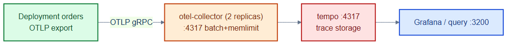
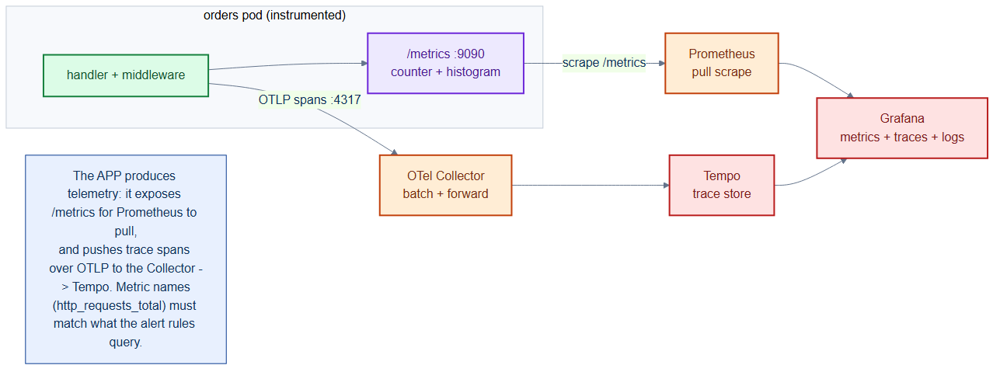

# otel-collector-tempo.yaml — distributed tracing pipeline

> **Folder:** `70-observability` · **Chapter:** [Ch 26 — Observability](../../../docs/26-observability.md)

Deploys the OpenTelemetry Collector and Grafana Tempo so services can emit
traces (OTLP) that are batched, forwarded, and stored for querying — the tracing
pillar of observability.

## Objects in this file

| Kind | Name | Namespace | Role |
|---|---|---|---|
| ConfigMap | `tempo-config` | `monitoring` | Tempo config: OTLP gRPC 4317, local trace storage |
| Deployment/Service | `tempo` | `monitoring` | `grafana/tempo:2.5.0`, ports 3200 (http), 4317 (otlp) |
| ConfigMap | `otel-collector-config` | `monitoring` | receivers OTLP 4317, batch + memory_limiter, export to Tempo |
| Deployment/Service | `otel-collector` | `monitoring` | 2 replicas, `otel/opentelemetry-collector-contrib:0.104.0` |

## How it works

- Services send OTLP traces to `otel-collector.monitoring:4317`; the collector
  batches and applies memory limits, then exports to Tempo.
- Tempo stores traces (emptyDir here — demo only; real deployments use object
  storage) and serves them to Grafana for query.
- Two collector replicas provide a resilient ingestion tier.

## Relationships

**Interacts with**
- [`../30-workloads/orders-deployment.yaml`](../30-workloads/orders-deployment.yaml) — its `OTEL_EXPORTER_OTLP_ENDPOINT` points here.
- [`orders-monitoring.yaml`](orders-monitoring.yaml) — metrics pillar alongside this traces pillar.

## Concept

See [Ch 26 — Observability](../../../docs/26-observability.md) for the full walkthrough.
