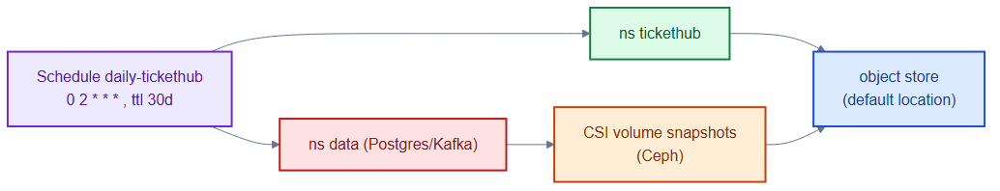
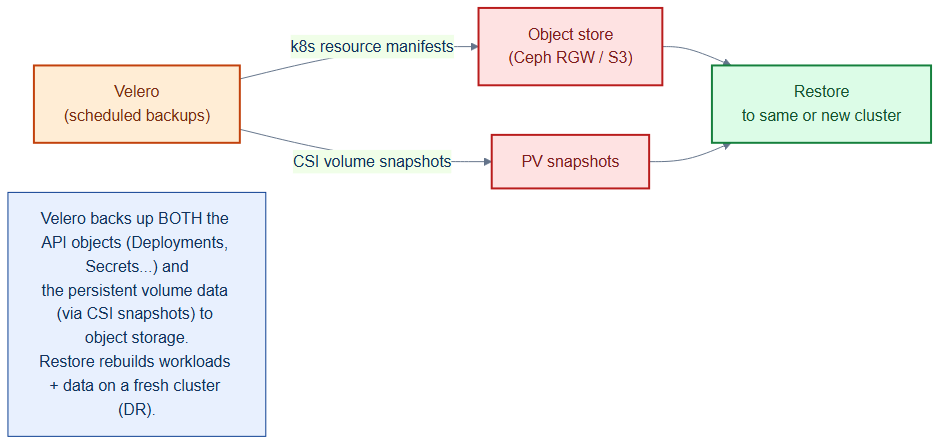

# velero-schedule.yaml — scheduled backups of app + data

> **Folder:** `70-observability` · **Chapter:** [Ch 27 — Backup, DR & Upgrades](../../../docs/27-backup-dr-upgrades.md)

A Velero `Schedule` that backs up the application and data namespaces nightly —
both the Kubernetes objects and the underlying volume snapshots — for disaster
recovery.

## Objects in this file

| Kind | Name | Namespace | Key settings |
|---|---|---|---|
| Schedule | `daily-tickethub` | `velero` | cron `0 2 * * *`, namespaces `tickethub` + `data`, `snapshotVolumes: true`, ttl 720h (30d) |

## How it works

- Every night at 02:00 Velero exports the resource manifests from both
  namespaces to object storage and triggers CSI volume snapshots of the Ceph
  PVs (Postgres, Kafka).
- The 30-day TTL auto-expires old backups.
- Restores can rebuild the workloads *and* their persistent data into a fresh
  cluster.

## Relationships

**Interacts with**
- [`../20-data/postgres-statefulset.yaml`](../20-data/postgres-statefulset.yaml) + [`kafka-statefulset.yaml`](../20-data/kafka-statefulset.yaml) — the stateful volumes snapshotted.
- [`../10-platform/storageclasses.yaml`](../10-platform/storageclasses.yaml) — `Retain` + CSI snapshots underpin recoverability.
- [`../50-scaling/pdb.yaml`](../50-scaling/pdb.yaml) — PDBs protect availability during the node upgrades DR planning covers.

## Concept

See [Ch 27 — Backup, DR & Upgrades](../../../docs/27-backup-dr-upgrades.md) for the full walkthrough.
